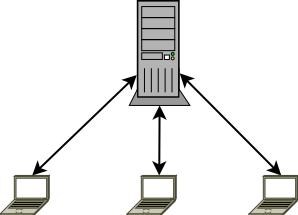
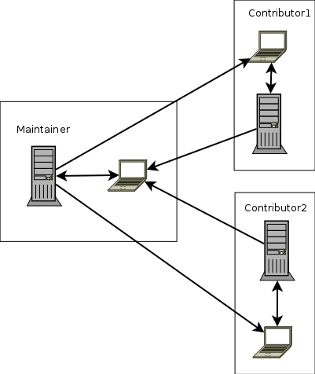

title: Git on the command-line
author: Andrew Sullivan Cant

## Versioning I have used before

* making copies
* [CSV](https://savannah.nongnu.org/projects/cvs)
* [Subversion](https://subversion.apache.org/)
* [Bazaar](http://bazaar.canonical.com/en/)
* [Git](https://git-scm.com/)

## Centralized flow


## vs Decentralized flow


## Directed Acyclic Graph


[source: GitVersionTree](https://github.com/crc8/GitVersionTree)

!SLIDE
# Let's do a demo!

## Gitflow

[source](http://nvie.com/posts/a-successful-git-branching-model/)

## git aliases
```
[alias]
	undo = reset --soft HEAD^
	rem  = rebase -i master
	ci   = commit -v
	cia  = commit -v -a
	ciam = commit -v --amend
	st   = status
	m    = checkout master
	p    = pull
	ch   = checkout
```

## git-extra

- `git extras`
- `git squash`
- `git summary`
- `git effort`
- `git changelog`
- `git commits-since`
- `git count`
- `git create-branch`
- `git delete-branch`
- `git delete-submodule`
- `git delete-tag`
- `git fresh-branch`
- `git graft`
- `git alias`
- `git ignore`
- `git info`
- `git release`
- `git contrib`
- `git repl`
- `git undo`
- `git gh-pages`
- `git setup`
- `git touch`
- `git obliterate`
- `git feature`
- `git refactor`
- `git bug`
- `git promote`
- `git local-commits`
- `git archive-file`

[source](https://github.com/tj/git-extras)

!SLIDE
# Questions?
